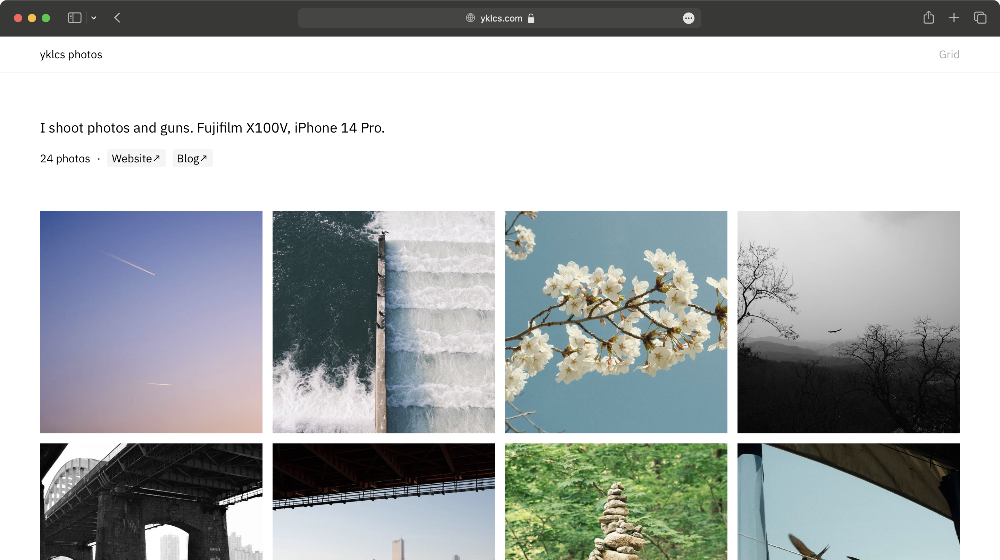

# chromogen

A static site generator for image galleries.



Some key features:

- Self-host anywhere
- Own your own images
- EXIF metadata support
- Incremental generation
- Minimal JavaScript, super light
- Themable and extendable
- Static site generation and (dev) server modes

## Get started

Build and install via the Go toolchain:

```shell
$ go install github.com/yklcs/chromogen@latest
$ chromogen build images
```

Building/serving related config is done through CLI flags, and site related config is done through [a JSON file](chromogen.example.json).
The config file location is expected to be at `chromogen.json` by default and can be changed with the `-c` flag.

```shell
# Build site from images/ and output to dist/
$ chromogen build images

# Build site from images/ and add new.jpg to site (incremental generation)
$ chromogen build images
$ chromogen build new.jpg

# Build site from images/ with config from config.json
$ chromogen build -c=config.json images/

# Serve site at port 1234 with images from images/
$ chromogen serve -p=1234 images/
```

## Theming

Theming is performed through [Go templates](https://pkg.go.dev/html/template) and static files.

Look at [theme/](theme/) for an example of the default theme.

Theme-specific config should go in `"theme_config"` of the config file.
